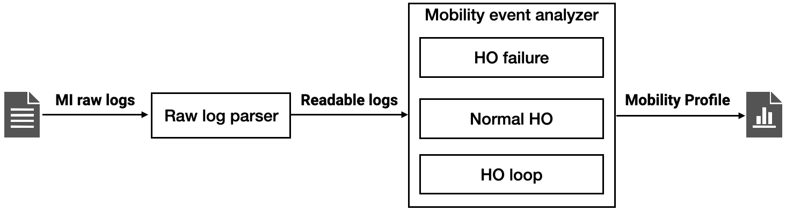

# Extreme Mobility Emulator

The emulator extracts real events mobility management from wireless network datasets.
It helps demonstrate the impact of (un)reliable mobility management on real applications, by replaying those events on cellular network testbeds (like [Flora](http://metro.cs.ucla.edu/flora.html)).
In particular, it is useful for analysis under extreme mobility (e.g. high-speed railway), given difficulties and high cost of running experiments.
With the emulator, researchers and developers can emulate extreme mobility conditions based on public datasets or replay data collected by themselves.
In addition, the emulator also considers mitigation of unreliable mobility management based on solutions like REM [1].

## Architecture

As the figure illustrates, the emulator consists of a raw log parser and mobility event analyzers.
- Raw log parser: Parse RRC/measurement logs to generate readable, normalized logs with full details of handovers
- Mobility event analyzers: for each mobility event, extract disruption time before and after applying REM (if applicable). It retrieves the following mobility events:
    - Handover failure. For each failure, calculate the disruption time, diagnose the failure cause and evaluate if REM can avoid it.
    - Handover success. For each instance, calculate the disruption time.

## Usage
### Raw log parser
Enter the folder to hold intermediate logs; Run the command below to parse all raw mobile logs under /path/to/raw/log/folder.
```
sh /path/to/repo/src/batch_monitor.sh /path/to/raw/log/folder
```

### Mobility analyzer
Read in intermediate logs generated in the previous steps and generate a profile including all mobility events.
```
python /path/to/repo/src/handoff_failure.py /path/to/intermediate/log/folder > mobility_profile.log
```

## Dataset description:

We generate mobility logs for a fine-grained high-speed railway dataset [1].
There are two types of logs:
- [Mobility profile](https://github.com/cathyli93/rem_private/blob/main/dataset/hsr_profile.log): the profile of mobility events
- [Intermediate mobility traces](https://www.dropbox.com/sh/naq2efo6s9ylwgj/AABnxzR-QfASMMKNjiakgLmAa?dl=0): more details in plain text for deeper analysis

### Mobility profiles
The profile logs describe mobility events of successful/failed handovers. We record the following information for each event:
- ``handover`` message has the format of "<file_name>,<time_of_handover_finished>,handover,<time_of_handover_start>,<source_freq>,<source_cell>,<target_freq>,<target_cell>"
- ``handover-failure`` message has the format of "<file_name>,<time_of_handover_finished>,handover-failure: <failure_cause>,<time_of_disconnection>,<source_freq>,<source_cell>,<target_freq>,<target_cell>[,can_be_avoided_by_REM]"
    - Options of ``failure_cause``: mobility message loss (command/feedback), missed neighbor cells, coverage hole (cannot be avoided by REM).

### Intermediate mobility logs 
The logs include RRC OTA traces of the following types and formats:
- ``Connection setup`` rrc-ota:<unix_time>,Connection setup,<new_cell_freq>,<new_cell_id>
- ``Handover failure`` rrc-ota:<unix_time>,Handover failure,<new_cell_freq>,<new_cell_id>,<unix_time_when_lose_old_connection>
- ``Handover`` rrc-ota:<unix_time>,Handover,<source_cell_freq>,<source_cell_id>,<target_cell_freq>,<target_cell_id>,<unix_time_when_handover_started>
- ``Measurement report`` rrc-ota:<unix_time>,Measurement report,<current_cell_freq>,<current_cell_id>,<report_content>
	- report_content is a Hash map (dictionary in Python) with the following keys:
	- serving_rsrp
	- serving_rsrq
	- measure_freq
	- event_type
	- threshold1
	- threshold2
	- time_to_trigger
    - hyst
	- serving_offset
	- measure_freq
	- results: a hash map from cell id to signal strengths; <cell_id>:[\<rsrp\>,\<rsrq\>,<cell_offset>]
- ``Measurement serving`` rrc-ota:<unix_time>,Measurement serving,<current_cell_freq>,<current_cell_id>,\<rsrp\>,\<rsrq\>
- ``Meas Config`` rrc-ota:<unix_time>,Meas Config,<current_cell_freq>,<current_cell_id>,\<configs\>; 
configs is a list of hash maps, each of which summarizes one measurement configuration with the following keys:
	- freq
	- event_type
	- threshold1
	- threshold2
	- serving_offset
	- cell_offset: a hash map from cell id to cell offset

## References

[1] Li, Yuanjie, Qianru Li, Zhehui Zhang, Ghufran Baig, Lili Qiu, and Songwu Lu. "Beyond 5g: Reliable extreme mobility management." In Proceedings of SIGCOMM 2020, pp. 344-358.
